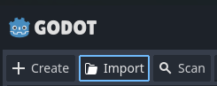

# Kirby Re-Creation In Godot

## ✒️ Description

Welcome to my attempt at re-creating Kirby! You'll have to fight through enemies using various means such as inhaling,spitting and taking the powers of enemies. There will be obstacles to get through 
other than the enemies as well, such as pitfalls, spikes etc. The end goal is to simply reach the end of the level. This is still a work in progress but will be completed soon.

## 🛠 Installation Steps

1. **Download Godot if not done already:**
   You can find Godot on [Steam](https://store.steampowered.com/app/404790/Godot_Engine/) or you can download it directly from their [Website](https://godotengine.org/)
3. **Clone the repository in your terminal:**
   ```bash
   git clone https://github.com/JoshKrav/Kirby_Game.git
   ```
3.**Import the repo in godot:**  
  
4.**Have Fun!**
  

   
#### 🖼️ Images/Sprites

-   Most images and sprites are from the community site, [SpritersResource](https://www.spriters-resource.com/game_boy_advance/kirbyandtheamazingmirror/sheet/2658/?source=genre).

#### 🔊 Sounds

All sounds are also taken from [SpritersResource](https://www.spriters-resource.com/game_boy_advance/kirbyandtheamazingmirror/sheet/2658/?source=genre)

### 📚 References

-   [Kirby Series By Nintendo](https://en.wikipedia.org/wiki/Kirby_(series))
